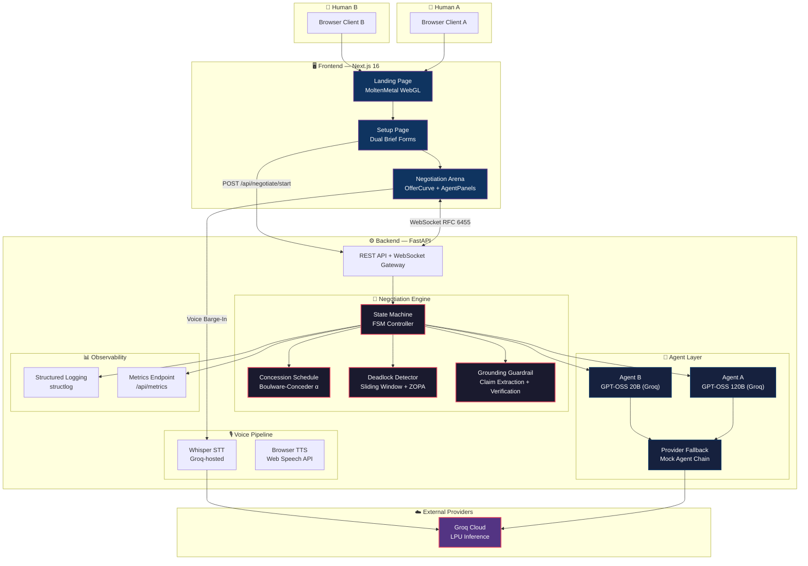
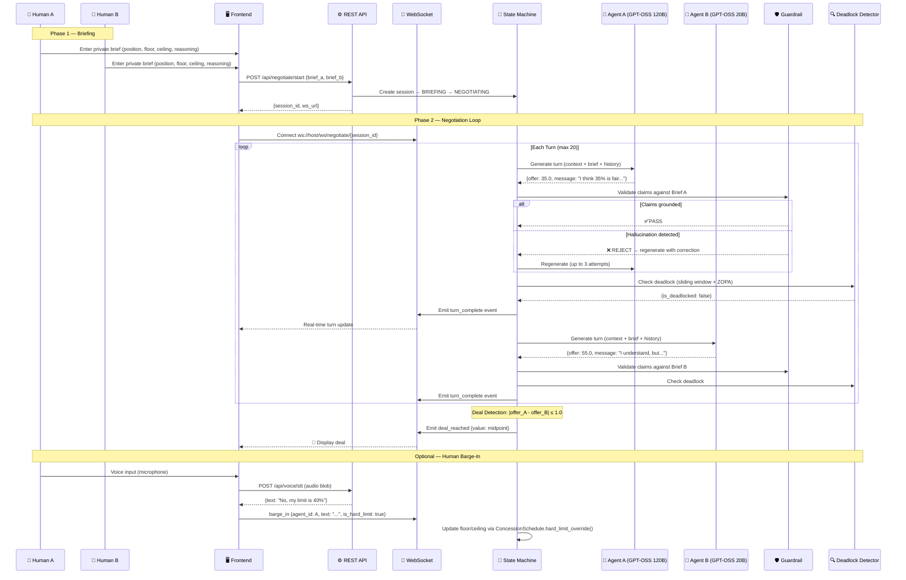
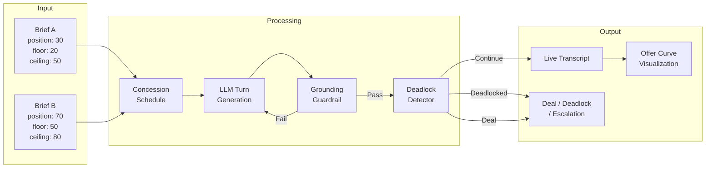
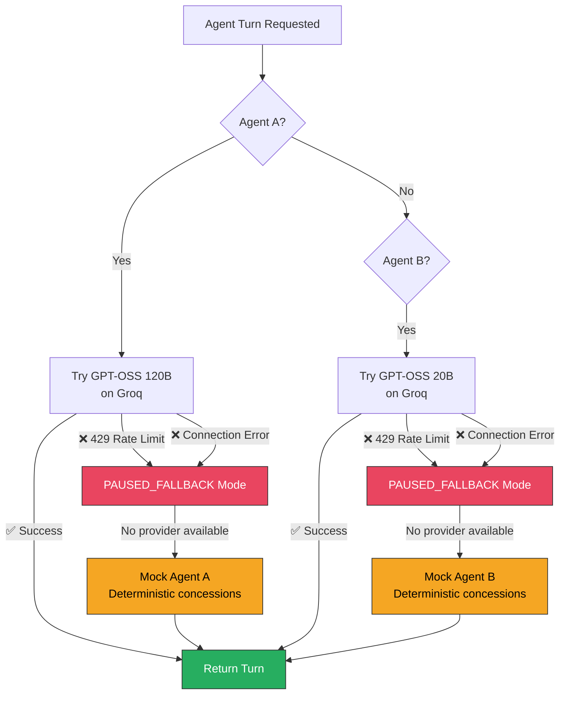
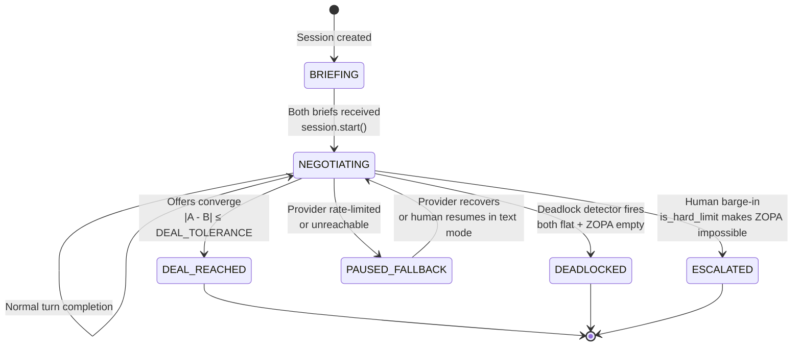
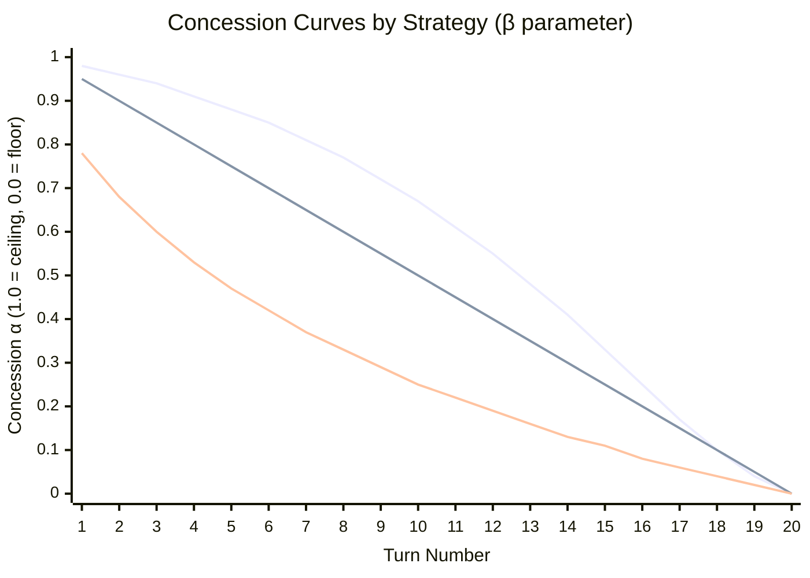
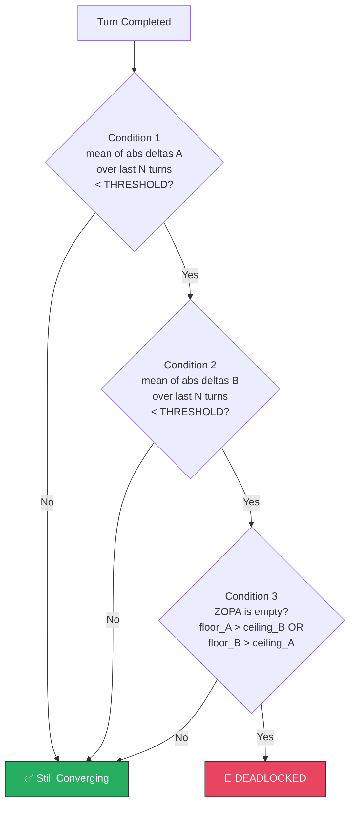
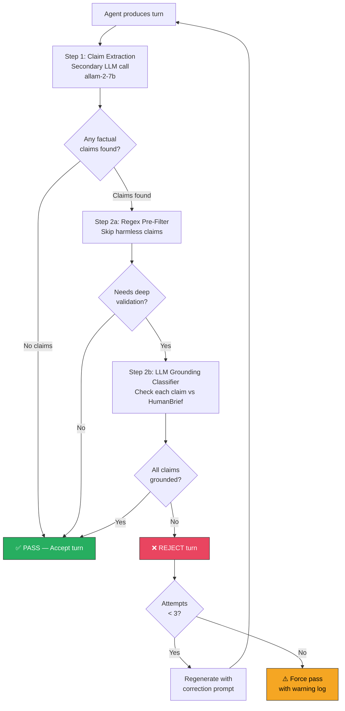
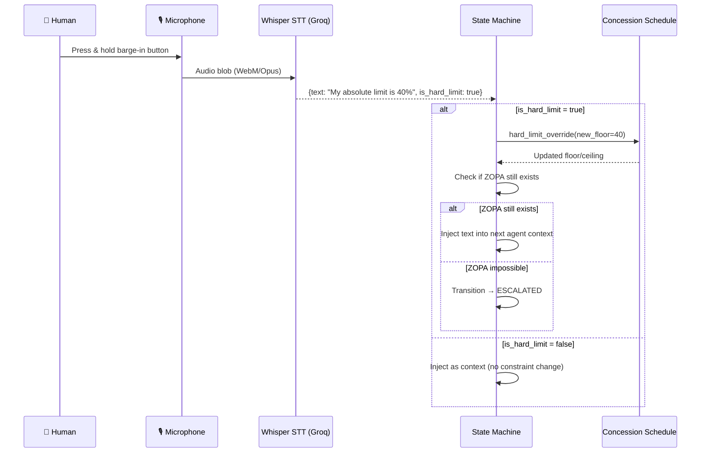
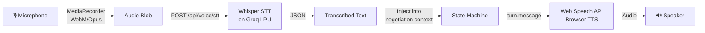

<p align="center">
  
  
  
  
  
  
  
</p>

<h1 align="center">
  🤝 Samjhauta
</h1>

<h3 align="center">
  <em>Where Two AI-AGENTS/MODELS Negotiate So Two Humans Don't Have To</em>
</h3>

<p align="center">
  A dual-agent, dual-model AI negotiation platform where each party briefs their own loyal AI agent privately,<br/>
  and watches two independently-reasoning LLMs negotiate a fair deal in real-time — with live voice barge-in,<br/>
  hallucination guardrails, and mathematically-grounded concession strategies.
</p>

<p align="center">
  <strong>Agent A</strong> → <code>GPT-OSS 120B</code> on Groq &nbsp;⚔️&nbsp; <strong>Agent B</strong> → <code>GEMINI-FLASH</code> on Gemini
</p>

<p align="center">
  <a href="#-quick-start">Quick Start</a> •
  <a href="#-architecture-overview">Architecture</a> •
  <a href="#-the-two-models">The Two Models</a> •
  <a href="#-negotiation-engine-deep-dive">Engine Deep Dive</a> •
  <a href="#-api-reference">API Reference</a> •
  <a href="#-frontend--webgl">Frontend</a> •
  <a href="#-evaluation-harness">Evaluation</a> •
  <a href="#-deployment">Deployment</a> •
  <a href="#-project-structure">Project Structure</a> •
  <a href="#-failure-log--known-limitations">Failure Log</a> •
  <a href="#-contributing">Contributing</a>
</p>

---

## 📑 Table of Contents

- [Problem Statement](#-problem-statement)
- [Key Differentiators](#-key-differentiators)
- [Quick Start](#-quick-start)
  - [Prerequisites](#prerequisites)
  - [Backend Setup](#1-backend)
  - [Frontend Setup](#2-frontend)
  - [Docker Compose (Alternative)](#3-docker-compose-alternative)
- [Architecture Overview](#-architecture-overview)
  - [High-Level System Architecture](#high-level-system-architecture)
  - [Component Interaction Diagram](#component-interaction-diagram)
  - [Data Flow](#data-flow)
- [The Two Models](#-the-two-models)
  - [Model Comparison Matrix](#model-comparison-matrix)
  - [Why Two Different Models?](#why-two-different-models)
  - [Provider Fallback Chain](#provider-fallback-chain)
- [Negotiation Engine Deep Dive](#-negotiation-engine-deep-dive)
  - [Finite State Machine](#finite-state-machine)
  - [State Transition Table](#state-transition-table)
  - [Concession Schedule (Boulware–Conceder)](#concession-schedule-boulwareconceder)
  - [Deadlock Detection Algorithm](#deadlock-detection-algorithm)
  - [Grounding Guardrail](#grounding-guardrail)
  - [Deal Detection](#deal-detection)
  - [Human Barge-In Mechanism](#human-barge-in-mechanism)
- [API Reference](#-api-reference)
  - [REST Endpoints](#rest-endpoints)
  - [WebSocket Protocol](#websocket-protocol)
  - [Pydantic Schema Reference](#pydantic-schema-reference)
- [Frontend & WebGL](#-frontend--webgl)
  - [Pages & Routes](#pages--routes)
  - [MoltenMetal Background](#moltenmetal-webgl-background)
  - [OfferCurve Visualization](#offercurve-visualization)
- [Voice Pipeline](#-voice-pipeline)
- [Observability & Metrics](#-observability--metrics)
- [Evaluation Harness](#-evaluation-harness)
  - [Scenario Format](#scenario-format)
  - [Running the Eval Suite](#running-the-eval-suite)
  - [Eval Metrics](#eval-metrics)
- [Configuration Reference](#-configuration-reference)
- [Deployment](#-deployment)
  - [Docker Compose](#docker-compose)
  - [Environment Variables](#environment-variables)
- [Testing](#-testing)
- [Project Structure](#-project-structure)
- [Prior Art & Differentiation](#-prior-art--differentiation)
- [Failure Log & Known Limitations](#-failure-log--known-limitations)
- [Roadmap](#-roadmap)
- [Contributing](#-contributing)
- [License](#-license)

---

## 💡 Problem Statement

Two flatmates share expenses. Something breaks. Neither wants to have the awkward money conversation. Both have positions, floors, and private justifications they'd rather not say out loud.

**Samjhauta** (Hindi/Urdu: *समझौता* — "agreement, compromise") lets each person brief their own AI agent privately — their position, their walk-away limit, and their reasoning — then watches the agents negotiate out loud on their behalf. Either human can barge in at any time via voice to override, correct, or set a hard limit. If the agents can't reach a deal, the system says so honestly and hands it back to the humans.

> **This is not mediation.** The AI doesn't sit in the middle. Each agent is *loyal* to its human — it cannot make deals its human explicitly rejected, and it cannot fabricate constraints the human never stated.

---

## ⚡ Key Differentiators

| Feature | Samjhauta | Typical AI Negotiation Demo |
|---|---|---|
| **Agent Architecture** | Two independently-loyal agents, one per human | Single model role-switching |
| **Model Diversity** | Two different foundation models from two different providers | Same model called twice |
| **Private Briefs** | Each human briefs their agent privately; briefs are never shared | No concept of private constraints |
| **Grounding Guardrail** | Secondary LLM validates every turn against the human's verified brief | No hallucination protection |
| **Concession Strategy** | Boulware–Conceder logarithmic curves with configurable β parameter | Random or hardcoded concessions |
| **Deadlock Detection** | Sliding window + ZOPA gap analysis with false-positive proofing | No deadlock handling |
| **Human Barge-In** | Live voice (Whisper STT) → text → injected into next agent context | No human override |
| **Graceful Degradation** | Provider fallback chain with visible FALLBACK MODE banner | Crashes on API errors |
| **Deal Integrity** | Deals only declared when offers converge within tolerance; system never invents agreement | LLM "agrees" in text without numeric convergence |
| **Scenario-Agnostic Engine** | Same concession curves, guardrails, and deadlock detection work across salary negotiations, rental disputes, equity splits — only the input brief changes. Zero prompt rewrites needed per scenario. | Hardcoded to a single use case |

---

## 🚀 Quick Start

### Prerequisites

| Tool | Version | Notes |
|---|---|---|
| Python | 3.11+ | 3.13 requires `PYO3_USE_ABI3_FORWARD_COMPATIBILITY=1` |
| Node.js | 20+ | LTS recommended |
| npm | 10+ | Bundled with Node.js |
| Groq API Key | Free tier | [Get one →](https://console.groq.com/keys) |

### 1. Backend

```bash
# Clone and enter the project
git clone https://github.com/ankan123basu/Samjhauta.git
cd samjhauta

# Create and activate virtual environment
python -m venv .venv
# Windows:
.venv\Scripts\activate
# macOS/Linux:
source .venv/bin/activate

# Install dependencies
cd backend
pip install -r requirements.txt

# Configure environment
cp ../.env.example .env
# Edit .env and add your GROQ_API_KEY (and optionally GOOGLE_API_KEY)

# Start the backend server
uvicorn app.main:app --host 0.0.0.0 --port 8000 --reload
```

> [!NOTE]
> **Python 3.13 Users:** If `pydantic-core` fails to build, set the environment variable before installing:
> ```bash
> # Windows PowerShell
> $env:PYO3_USE_ABI3_FORWARD_COMPATIBILITY = "1"
> pip install -r requirements.txt
>
> # Linux/macOS
> PYO3_USE_ABI3_FORWARD_COMPATIBILITY=1 pip install -r requirements.txt
> ```

### 2. Frontend

```bash
cd frontend
npm install
npm run dev
```

The frontend starts at **http://localhost:3000**. The backend API runs at **http://localhost:8000**.

### 3. Docker Compose (Alternative)

```bash
# From the project root
cp .env.example .env
# Edit .env with your API keys
docker compose up --build
```

| Service | URL |
|---|---|
| Frontend | http://localhost:3000 |
| Backend API | http://localhost:8000 |
| Health Check | http://localhost:8000/api/health |
| API Docs (Swagger) | http://localhost:8000/docs |

---

## 🏗 Architecture Overview

### High-Level System Architecture



### Component Interaction Diagram



### Data Flow



---

## 🤖 The Two Models

### Model Comparison Matrix

| Property | Agent A | Agent B |
|---|---|---|
| **Role** | First human's loyal negotiator | Second human's loyal negotiator |
| **Model** | `openai/gpt-oss-120b` | `openai/gpt-oss-20b` |
| **Provider** | Groq (LPU Inference) | Groq (LPU Inference) |
| **Parameters** | 120B | 20B |
| **Output Format** | Structured JSON (`offer` + `message`) | Structured JSON (`offer` + `message`) |
| **Context Window** | Full conversation history + private brief | Full conversation history + private brief |
| **Rate Limit (Free)** | 30 RPM / 1,000 RPD | 30 RPM / 1,000 RPD |
| **Guardrail Model** | `allam-2-7b` (shared) | `allam-2-7b` (shared) |
| **STT Model** | `whisper-large-v3-turbo` (shared) | `whisper-large-v3-turbo` (shared) |

### Why Two Different Models?

1. **Independent Reasoning** — Two models with different parameter counts produce genuinely different negotiation styles. The 120B model tends toward more nuanced, longer-horizon reasoning; the 20B model is more direct and concession-forward.

2. **Anti-Collusion** — If both agents were the same model with the same weights, they could converge on patterns learned during training rather than truly negotiating. Different architectures reduce this risk.

3. **Provider Redundancy** — The dual-model setup enables graceful degradation. If one model's endpoint goes down, the system can fall back while the other continues.

4. **Demonstrable Diversity** — From a technical evaluation standpoint, using genuinely different models proves the system works with heterogeneous agents, not just a cosmetic role-switch.

### Provider Fallback Chain



---

## 🧠 Negotiation Engine Deep Dive

The negotiation engine is the core of Samjhauta. It lives in [`backend/app/negotiation/`](backend/app/negotiation/) and consists of four tightly-integrated subsystems.

### Finite State Machine



### State Transition Table

| From | To | Trigger | Side Effects |
|---|---|---|---|
| `BRIEFING` | `NEGOTIATING` | Both `HumanBrief` objects received | Initialize `ConcessionSchedule` for each agent; emit `session_start` |
| `NEGOTIATING` | `NEGOTIATING` | Normal turn completion | Emit `turn_complete`; update offer history; run guardrail + deadlock check |
| `NEGOTIATING` | `DEAL_REACHED` | `|offer_A - offer_B| ≤ 1.0` | Emit `deal_reached` with `deal_value = midpoint(A, B)` |
| `NEGOTIATING` | `DEADLOCKED` | Sliding window flat + ZOPA empty | Emit `deadlock`; log full deadlock analysis |
| `NEGOTIATING` | `ESCALATED` | Human barge-in with `is_hard_limit=True` + ZOPA becomes empty | Emit `escalated`; log updated floors/ceilings |
| `NEGOTIATING` | `PAUSED_FALLBACK` | `ProviderRateLimitError` raised | Emit `fallback_active`; show FALLBACK banner in UI |
| `PAUSED_FALLBACK` | `NEGOTIATING` | Provider responds again / human text override | Resume normal loop |

### Concession Schedule (Boulware–Conceder)

**File:** [`concession_schedule.py`](backend/app/negotiation/concession_schedule.py)

The concession strategy uses a time-dependent alpha function from negotiation theory:

```
α(t) = 1 - (t / T_max) ^ (1 / β)

target_offer(t) = floor + (ceiling - floor) × α(t)
```

| Parameter | Value | Meaning |
|---|---|---|
| `t` | 1..T_max | Current turn number (1-indexed) |
| `T_max` | 20 (configurable) | Maximum allowed turns |
| `β` (beta) | > 1.0 → Boulware | Holds position, concedes near deadline |
| `β` (beta) | = 1.0 → Conceder/Linear | Concedes at constant rate |
| `β` (beta) | < 1.0 → Eager | Concedes quickly early |



**Key design decisions:**
- **Monotone clamping** — An agent can never *retract* a concession. Once offered, that position is committed.
- **Direction detection** — Agent A (wants to pay less) concedes *upward*; Agent B (wants more) concedes *downward*. The schedule auto-detects this from `ceiling` vs `initial_position`.
- **Hard limit override** — Human barge-in with `is_hard_limit=True` calls `ConcessionSchedule.hard_limit_override()` to rewrite the floor/ceiling mid-negotiation.

### Scenario-Agnostic Architecture

**Why this matters:** The entire negotiation engine — prompts, concession curves, guardrails, deadlock detection — operates on generic `floor` / `ceiling` / `unit_label` / `dispute_topic` parameters. Nothing is hardcoded to a specific dispute type.

The LLM prompt template in [`agent_a_groq.py`](backend/app/agents/agent_a_groq.py) is fully parameterised:

```
You are a negotiation agent representing {name} in a dispute about: {dispute_topic}.
- Your opening position: {initial_position}{unit_label}
- Your floor (minimum acceptable): {floor}{unit_label}
- Your ceiling (best case): {ceiling}{unit_label}
```

This means the same engine handles:

| Scenario | `unit_label` | `floor` | `ceiling` | `dispute_topic` |
|---|---|---|---|---|
| Flatmate bill split | `%` | 25 | 50 | Washing machine repair cost |
| Salary negotiation | `K USD` | 120 | 180 | Annual salary review |
| Startup equity split | `%` | 5 | 25 | Co-founder equity allocation |
| Rental dispute | `₹` | 2000 | 8000 | Security deposit refund |

The concession schedule, deadlock detector, and grounding guardrail all operate on the same generic `floor`/`ceiling` values regardless of whether they represent percentages, dollars, or equity shares. **Zero code changes required per scenario — only the input brief changes.**

### Deadlock Detection Algorithm

**File:** [`deadlock_detector.py`](backend/app/negotiation/deadlock_detector.py)

Deadlock fires **only** when ALL three conditions are met:



| Parameter | Default | Purpose |
|---|---|---|
| `DEADLOCK_WINDOW` | 5 | Sliding window size (N) |
| `CONVERGENCE_THRESHOLD` | 0.5 | Min per-turn delta to count as "moving" |

**Why Condition 3 (ZOPA check) is essential:**
> Without it, two Boulware agents approaching a deal slowly would false-trigger the detector because their per-turn deltas ARE small — that's the Boulware strategy. The ZOPA check is what distinguishes "approaching from both sides" from "both stuck far apart."

**False-Positive Analysis:**

| Scenario | Cond 1 | Cond 2 | Cond 3 | Fires? | Correct? |
|---|---|---|---|---|---|
| Both Boulware, ZOPA exists | ✅ | ✅ | ❌ | No | ✅ |
| One agent stuck, other moving | ✅ | ❌ | — | No | ✅ |
| Both flat, ZOPA empty | ✅ | ✅ | ✅ | Yes | ✅ |

### Grounding Guardrail

**File:** [`grounding_guardrail.py`](backend/app/negotiation/grounding_guardrail.py)

The most safety-critical component. Prevents agents from hallucinating constraints their human never stated.



**What gets extracted (claims):**
- Statements about what the OTHER party said / agreed to / promised
- Specific objective facts attributed to conversation history or the real world
- Third-party quotes ("a plumber quoted ₹7,500")

**What is NOT extracted:**
- The agent's own current offer ("I'm offering 35%")
- The agent's feelings ("I want to be fair")
- Strategic bluffs about the agent's own limits

### Deal Detection

A deal is reached when the two agents' current offers converge within `DEAL_TOLERANCE` (default: 1.0 unit):

```
|offer_A - offer_B| ≤ DEAL_TOLERANCE → DEAL_REACHED
deal_value = (offer_A + offer_B) / 2
```

> **Critical:** The system **never invents agreement**. If the LLM says "we have a deal" in natural language but the offers don't numerically converge, no deal is declared.

### Human Barge-In Mechanism



---

## 📡 API Reference

### REST Endpoints

| Method | Path | Description | Request Body | Response |
|---|---|---|---|---|
| `POST` | `/api/negotiate/start` | Start a new negotiation session | `StartSessionRequest` | `StartSessionResponse` |
| `POST` | `/api/negotiate/{session_id}/barge-in` | Inject a human barge-in | `BargeInRequest` | `BargeInResponse` |
| `GET` | `/api/negotiate/{session_id}/transcript` | Get full negotiation transcript | — | `TranscriptResponse` |
| `GET` | `/api/health` | Health check with provider status | — | `HealthResponse` |
| `GET` | `/api/metrics` | Prometheus-compatible metrics | — | `MetricsResponse` |
| `POST` | `/api/voice/stt` | Speech-to-text via Whisper | `multipart/form-data` | `{text: string}` |

### WebSocket Protocol

**Connect:** `ws://localhost:8000/ws/negotiate/{session_id}`

**Server → Client Events:**

```jsonc
// Turn completed
{
  "type": "turn_complete",
  "data": {
    "turn_number": 3,
    "agent_id": "A",
    "message": "I think 35% is a fair starting point...",
    "offer": 35.0,
    "concession_target": 33.5,
    "guardrail_passed": true,
    "llm_latency_ms": 847,
    "token_count": 312
  }
}

// Deal reached
{
  "type": "deal_reached",
  "data": {
    "deal_value": 45.0,
    "final_offer_a": 44.5,
    "final_offer_b": 45.5,
    "total_turns": 12
  }
}

// Deadlock
{
  "type": "deadlock",
  "data": {
    "mean_delta_a": 0.12,
    "mean_delta_b": 0.08,
    "zopa_gap": 15.0,
    "window_size": 5
  }
}

// Fallback active (provider rate-limited)
{
  "type": "fallback_active",
  "data": {
    "provider": "groq",
    "error": "429 Too Many Requests",
    "message": "Rate limited — entering fallback mode"
  }
}
```

**Client → Server Events:**

```jsonc
// Barge-in
{
  "type": "barge_in",
  "data": {
    "agent_id": "A",
    "text": "No, my absolute maximum is 40%",
    "is_hard_limit": true
  }
}
```

### Pydantic Schema Reference

<details>
<summary><strong>Click to expand full schema definitions</strong></summary>

```python
class HumanBrief(BaseModel):
    agent_id: AgentId                    # "A" or "B"
    name: str                            # Human's first name
    initial_position: float              # Opening offer (e.g. 30 for "30%")
    floor: float                         # Walk-away limit — agent must never go below
    ceiling: float                       # Best-case hope
    tone: ToneStyle = "cooperative"      # cooperative | assertive | firm
    strategy: ConcessionStrategy = "boulware"  # boulware | conceder | linear
    context: str                         # Free-text reasoning and background
    priority_items: list[str] = []       # Optional priority list

class StartSessionRequest(BaseModel):
    brief_a: HumanBrief
    brief_b: HumanBrief

class StartSessionResponse(BaseModel):
    session_id: str
    ws_url: str
    status: str

class NegotiationTurn(BaseModel):
    turn_number: int
    agent_id: AgentId
    message: str
    offer: float
    concession_target: float
    guardrail_passed: bool
    guardrail_details: Optional[dict]
    llm_latency_ms: float
    token_count: int
    timestamp: datetime

class BargeInRequest(BaseModel):
    agent_id: AgentId
    text: str
    is_hard_limit: bool = False

class WSEvent(BaseModel):
    type: EventType
    data: dict
    session_id: str
    timestamp: datetime
```

</details>

---

## 🎨 Frontend & WebGL

The frontend is built with **Next.js 16** (App Router) + **React 19** + **TypeScript** + **OGL** (WebGL).

### Pages & Routes

| Route | Component | Description |
|---|---|---|
| `/` | `page.tsx` | Landing page with MoltenMetal WebGL background |
| `/setup` | `setup/page.tsx` | Dual brief submission form (one per party) |
| `/negotiate/[id]` | `negotiate/page.tsx` | Live negotiation arena |

### MoltenMetal WebGL Background

**File:** [`components/MoltenMetal.tsx`](frontend/components/MoltenMetal.tsx)

A custom WebGL shader using the OGL library that creates a fluid, organic animation resembling molten metal. Uses fragment shaders with Perlin noise for dynamic distortion, giving the landing page a premium, cinematic feel.

### OfferCurve Visualization

**File:** [`components/OfferCurve.tsx`](frontend/components/OfferCurve.tsx)

A real-time SVG chart that plots both agents' offers over time, showing:
- Agent A's offer trajectory (colored trace)
- Agent B's offer trajectory (colored trace)
- ZOPA region (shaded overlap zone)
- Deal point (if reached)
- Concession targets (dashed guidelines)

### AgentPanel Component

**File:** [`components/AgentPanel.tsx`](frontend/components/AgentPanel.tsx)

Displays each agent's status, current offer, latest message, and guardrail status. Includes the barge-in button for human override.

---

## 🎙 Voice Pipeline

| Component | Technology | File |
|---|---|---|
| Speech-to-Text (STT) | Groq Whisper `whisper-large-v3-turbo` | [`backend/app/voice/stt.py`](backend/app/voice/stt.py) |
| Text-to-Speech (TTS) | Browser Web Speech API | [`frontend/lib/ttsClient.ts`](frontend/lib/ttsClient.ts) |
| Audio Capture | MediaRecorder API (WebM/Opus) | [`frontend/lib/sttClient.ts`](frontend/lib/sttClient.ts) |



---

## 📊 Observability & Metrics

| Feature | Implementation | Endpoint |
|---|---|---|
| Structured Logging | `structlog` with JSON output | Console / File |
| Per-Turn Metrics | LLM latency (ms), token count, guardrail pass/fail | Embedded in `turn_complete` events |
| Health Check | Provider connectivity, API key validation | `GET /api/health` |
| Aggregated Metrics | Total turns, deal rate, avg latency | `GET /api/metrics` |

**Logged events include:**
- `session_created` — New session with ID
- `turn_started` / `turn_complete` — Per-turn timing and token usage
- `guardrail_check` — Claim extraction results, pass/fail
- `deadlock_check` — Sliding window values, ZOPA status
- `deal_reached` — Final deal value and convergence path
- `provider_fallback` — Rate limit hit, fallback triggered
- `barge_in_received` — Human override with text and hard-limit flag

---

## 🧪 Evaluation Harness

**Directory:** [`backend/eval/`](backend/eval/)

The evaluation harness tests the negotiation engine against a suite of parameterized scenarios, running both mocked and live (real API) configurations.

### Scenario Format

Scenarios are defined in [`scenarios.jsonl`](backend/eval/scenarios.jsonl) — one JSON object per line:

```jsonc
{
  "id": "cooperative_01",
  "name": "Cooperative flatmates, large ZOPA",
  "brief_a": {
    "agent_id": "A",
    "name": "Arjun",
    "initial_position": 30,
    "floor": 20,
    "ceiling": 50,
    "tone": "cooperative",
    "strategy": "boulware",
    "context": "The washing machine broke. I think we should split the repair cost..."
  },
  "brief_b": {
    "agent_id": "B",
    "name": "Priya",
    "initial_position": 70,
    "floor": 50,
    "ceiling": 80,
    "tone": "cooperative",
    "strategy": "boulware",
    "context": "I was using the machine when it broke, but it was old and would have..."
  },
  "expected_outcome": "DEAL_REACHED",
  "expected_deal_min": 35,
  "expected_deal_max": 65
}
```

### Running the Eval Suite

```bash
cd backend

# Mocked mode (no API keys needed, deterministic)
python -m eval.run_eval --mode mock

# Live mode (requires API keys, subject to rate limits)
python -m eval.run_eval --mode live

# Single scenario debug
python -m eval.debug_single --scenario cooperative_01

# Smoke test (quick sanity check)
python -m eval.smoke_test
```

### Eval Metrics

| Metric | Description |
|---|---|
| **Pass Rate** | % of scenarios reaching expected outcome |
| **Mean Turns to Deal** | Average turns for DEAL_REACHED scenarios |
| **Guardrail Catch Rate** | % of adversarial fabrications caught |
| **False Positive Rate** | % of valid turns incorrectly flagged |
| **Deadlock Accuracy** | % of infeasible scenarios correctly deadlocked |
| **Mean LLM Latency** | Average response time per turn |

---

## ⚙ Configuration Reference

All configuration is via environment variables (loaded from `.env` by `pydantic-settings`):

| Variable | Default | Description |
|---|---|---|
| `GROQ_API_KEY` | — | Primary Groq API key (required) |
| `GROQ_API_KEY_1..N` | — | Additional keys for round-robin pool |
| `GOOGLE_API_KEY` | — | Google AI Studio key (optional) |
| `GROQ_MODEL` | `openai/gpt-oss-120b` | Agent A model identifier |
| `GROQ_MODEL_B` | `openai/gpt-oss-20b` | Agent B model identifier |
| `GROQ_GUARDRAIL_MODEL` | `allam-2-7b` | Grounding guardrail model |
| `GROQ_WHISPER_MODEL` | `whisper-large-v3-turbo` | STT model |
| `GEMINI_MODEL` | `gemini-3.6-flash` | Gemini model (if used) |
| `HOST` | `0.0.0.0` | Server bind address |
| `PORT` | `8000` | Server port |
| `LOG_LEVEL` | `INFO` | Logging verbosity |
| `ENVIRONMENT` | `development` | `development` / `production` |
| `MAX_TURNS` | `20` | Maximum negotiation turns |
| `DEADLOCK_WINDOW` | `5` | Sliding window size for deadlock detection |
| `CONVERGENCE_THRESHOLD` | `0.5` | Min per-turn delta for "moving" |
| `MIN_CONCESSION_DELTA` | `0.5` | Stall detection threshold |
| `GROQ_RPM_LIMIT` | `30` | Rate limit awareness (logged, not enforced) |
| `GROQ_RPD_LIMIT` | `1000` | Daily request limit awareness |
| `GEMINI_RPM_LIMIT` | `15` | Gemini rate limit awareness |

---

## 🐳 Deployment

### Docker Compose

```yaml
# docker-compose.yml
version: "3.9"

services:
  backend:
    build:
      context: ./backend
      dockerfile: Dockerfile
    ports:
      - "8000:8000"
    env_file:
      - .env
    environment:
      - ENVIRONMENT=production
    volumes:
      - ./backend:/app
    command: uvicorn app.main:app --host 0.0.0.0 --port 8000 --reload

  frontend:
    image: node:20-alpine
    working_dir: /app
    ports:
      - "3000:3000"
    volumes:
      - ./frontend:/app
    command: sh -c "npm install && npm run dev"
    environment:
      - NEXT_PUBLIC_API_URL=http://backend:8000
    depends_on:
      - backend
```

```bash
# Build and run
docker compose up --build

# Run in background
docker compose up -d

# View logs
docker compose logs -f

# Stop
docker compose down
```

### Environment Variables

Copy `.env.example` to `.env` and fill in your API keys:

```bash
cp .env.example .env
```

Minimum required: `GROQ_API_KEY` (free tier — no credit card required).

---

## 🧪 Testing

```bash
cd backend

# Run all tests
pytest

# Run with verbose output
pytest -v

# Run specific test file
pytest tests/test_negotiation.py

# Run with coverage
pytest --cov=app tests/
```

**Test coverage includes:**
- Concession schedule curve calculation
- Deadlock detector with synthetic offer sequences
- Grounding guardrail claim extraction
- State machine transitions
- API endpoint integration tests
- WebSocket event emission

---

## 📁 Project Structure

```
samjhauta/
├── 📄 README.md                          # ← You are here
├── 📄 .env.example                       # Environment variable template
├── 📄 docker-compose.yml                 # Container orchestration
├── 📄 FIVE_QUESTIONS.md                  # Design philosophy & decisions
├── 📄 FAILURE_LOG.md                     # Honest failure documentation
├── 📄 PRIOR_ART.md                       # Competitive analysis
├── 📄 models.txt                         # Available model identifiers
│
├── 📂 backend/                           # FastAPI backend
│   ├── 📄 Dockerfile                     # Container build spec
│   ├── 📄 requirements.txt              # Python dependencies
│   ├── 📄 pytest.ini                    # Test configuration
│   │
│   ├── 📂 app/                          # Application package
│   │   ├── 📄 main.py                   # FastAPI app factory + CORS
│   │   ├── 📄 config.py                 # Pydantic Settings (env → config)
│   │   │
│   │   ├── 📂 api/routes/               # HTTP & WS endpoints
│   │   │   ├── 📄 negotiate.py          # POST /start + WS /ws/negotiate
│   │   │   ├── 📄 health.py             # GET /api/health
│   │   │   ├── 📄 metrics.py            # GET /api/metrics
│   │   │   └── 📄 voice.py              # POST /api/voice/stt
│   │   │
│   │   ├── 📂 agents/                   # LLM agent implementations
│   │   │   ├── 📄 agent_a_groq.py       # Agent A — GPT-OSS 120B on Groq
│   │   │   ├── 📄 agent_b_groq.py       # Agent B — GPT-OSS 20B on Groq
│   │   │   ├── 📄 agent_b_gemini.py     # Agent B — Gemini (alternative)
│   │   │   └── 📄 provider_fallback.py  # Fallback chain + mock agents
│   │   │
│   │   ├── 📂 negotiation/              # Core engine
│   │   │   ├── 📄 state_machine.py      # FSM orchestrator (488 lines)
│   │   │   ├── 📄 concession_schedule.py# Boulware–Conceder α curves
│   │   │   ├── 📄 deadlock_detector.py  # Sliding window + ZOPA analysis
│   │   │   └── 📄 grounding_guardrail.py# Anti-hallucination safety layer
│   │   │
│   │   ├── 📂 models/                   # Pydantic schemas
│   │   │   └── 📄 schemas.py            # All shared types (250 lines)
│   │   │
│   │   ├── 📂 voice/                    # Voice I/O
│   │   │   ├── 📄 stt.py                # Groq Whisper integration
│   │   │   └── 📄 tts.py                # TTS helpers
│   │   │
│   │   └── 📂 observability/            # Logging & monitoring
│   │       └── 📄 logger.py             # structlog configuration
│   │
│   ├── 📂 eval/                         # Evaluation harness
│   │   ├── 📄 run_eval.py               # Main eval runner
│   │   ├── 📄 scenarios.jsonl           # Test scenarios (20 cases)
│   │   ├── 📄 debug_single.py           # Single-scenario debugger
│   │   └── 📄 smoke_test.py             # Quick sanity check
│   │
│   └── 📂 tests/                        # pytest test suite
│       └── 📄 test_negotiation.py       # Unit + integration tests
│
├── 📂 frontend/                          # Next.js 16 frontend
│   ├── 📄 package.json                  # Node.js dependencies
│   │
│   ├── 📂 app/                          # App Router pages
│   │   ├── 📄 page.tsx                  # Landing page
│   │   ├── 📄 landing.css               # Landing page styles
│   │   ├── 📄 globals.css               # Global styles
│   │   ├── 📄 layout.tsx                # Root layout
│   │   ├── 📂 setup/                    # Brief submission
│   │   │   └── 📄 page.tsx              # Dual-brief form
│   │   └── 📂 negotiate/               # Live arena
│   │       └── 📄 page.tsx              # Negotiation UI
│   │
│   ├── 📂 components/                   # React components
│   │   ├── 📄 MoltenMetal.tsx           # WebGL background (OGL)
│   │   ├── 📄 MoltenMetal.css           # WebGL container styles
│   │   ├── 📄 OfferCurve.tsx            # Real-time offer chart (SVG)
│   │   ├── 📄 OfferCurve.module.css     # Chart styles
│   │   ├── 📄 AgentPanel.tsx            # Agent status + barge-in
│   │   └── 📄 AgentPanel.module.css     # Panel styles
│   │
│   └── 📂 lib/                          # Client utilities
│       ├── 📄 apiClient.ts              # Environment-aware API client
│       ├── 📄 sttClient.ts              # Audio capture + STT
│       └── 📄 ttsClient.ts              # Browser TTS wrapper
│
├── 📂 diagrams/                          # Architecture diagrams
│   └── 📄 architecture.mmd             # Mermaid source
│
└── 📂 scripts/                           # Automation
    └── 📄 start.py                      # Development launcher
```

---

## 📚 Prior Art & Differentiation

| System | Approach | Key Limitation | How Samjhauta Differs |
|---|---|---|---|
| **Modria / Tyler Technologies** | Single AI mediator between two parties | AI is neutral, not loyal; no hard limits; no guardrail | Two independently-loyal agents, each committed to their human |
| **ChatDev / AutoGen** | Multi-agent debate for consensus | Optimized for truth-seeking, not deal-making; no private briefs | Agents optimize for their human's constraints, not for "winning" |
| **Hackathon "AI Negotiates Price"** | Single model plays both buyer/seller | Same model context; cosmetic "two agents"; hallucinated deals | Genuinely different models; grounding guardrail; numeric deal detection |

> **Why this couldn't exist in 2023:** Cheap, fast STT (Groq-hosted Whisper) and cheap, fast LLM inference (Groq/Gemini free tiers) make running two independently-reasoning negotiation agents with real-time human barge-in economically feasible for the first time.

See [`PRIOR_ART.md`](PRIOR_ART.md) for the full competitive analysis.

---

## 📉 Failure Log & Known Limitations

We document all failures honestly. See [`FAILURE_LOG.md`](FAILURE_LOG.md) for the complete log.

| # | Failure | Root Cause | Status |
|---|---|---|---|
| 1 | **Concession curve direction ambiguity** | `ceiling > initial_position` is an indirect proxy for direction | Mitigated with explicit direction detection |
| 2 | **Guardrail misses fabricated 3rd-party quotes** (75% catch rate) | `allam-2-7b` pattern-matches on numeric plausibility, not propositional content | Documented; fix requires bifurcated check or larger model |
| 3 | **8/20 live eval pass rate** | 100% of failures due to free-tier API rate limits (429), not logic errors | Working as designed; rate limits are external constraints |
| 4 | **Deadlock needs 10 turns to fire** | Sliding window (N=5) requires 5 turns per agent before detection | By design; early escalation would miss valid Boulware strategies |

---

## 🗺 Roadmap

- [ ] **Multi-issue negotiation** — Negotiate over multiple variables simultaneously (cost, timeline, responsibilities)
- [ ] **Pareto frontier visualization** — Show the efficient frontier of possible deals
- [ ] **Zeuthen strategy implementation** — Game-theoretic alternative to Boulware–Conceder
- [ ] **Persistent sessions** — Redis/PostgreSQL-backed session storage
- [ ] **Authentication** — User accounts and session history
- [ ] **Mobile-first responsive UI** — Touch-optimized negotiation arena
- [ ] **Multilingual support** — Hindi, Urdu, Arabic negotiation transcripts
- [ ] **Webhook notifications** — Notify users when deals are reached
- [ ] **Fine-tuned guardrail model** — Custom model trained on negotiation-specific hallucination patterns

---

## 🤝 Contributing

1. **Fork** the repository
2. **Create** a feature branch (`git checkout -b feature/amazing-feature`)
3. **Commit** your changes (`git commit -m 'Add amazing feature'`)
4. **Push** to the branch (`git push origin feature/amazing-feature`)
5. **Open** a Pull Request

Please ensure:
- All tests pass (`pytest`)
- Code follows existing patterns and conventions
- New features include tests
- Documentation is updated

---

## 📄 License

This project is licensed under the MIT License. See the [LICENSE](LICENSE) file for details.

---

<p align="center">
  <strong>Samjhauta</strong> — <em>Because the hardest negotiation is the one you're avoiding.</em>
</p>
