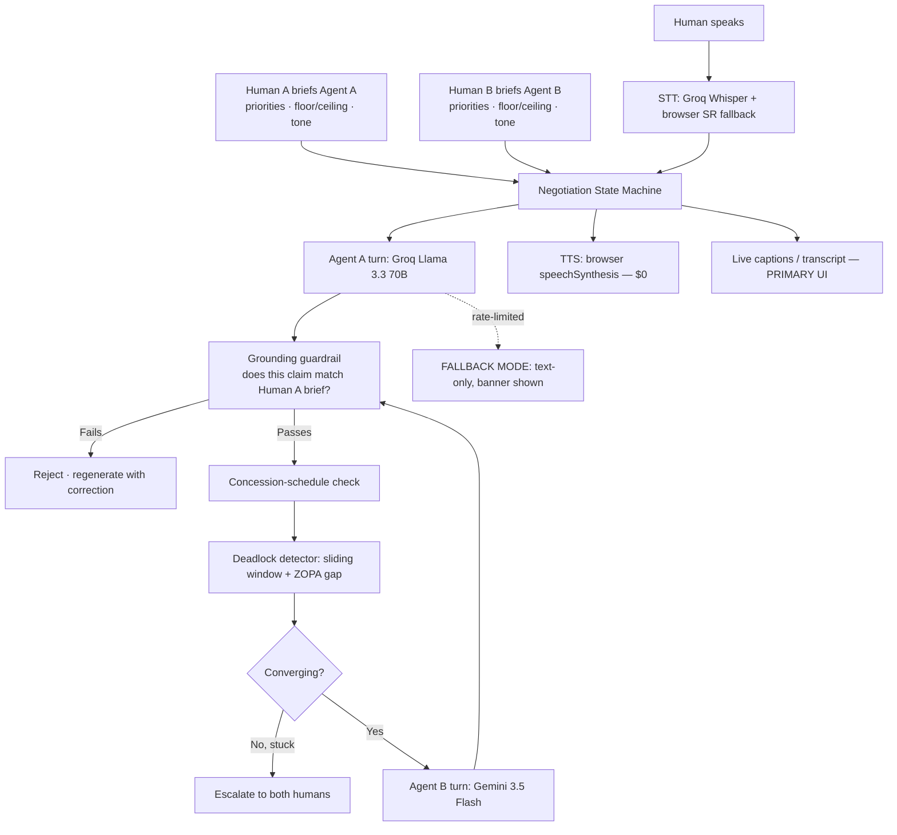

# Samjhauta — AI Negotiation Engine

> *"Two AI agents. One dispute. Zero fake agreements."*

Two flatmates who keep avoiding the awkward conversation about splitting a broken appliance bill each brief their own AI agent privately. The two agents negotiate out loud while either human can barge in, override, or set a hard limit mid-negotiation.

---

## 1. Problem & Persona

**The situation:** Arjun and Priya share a flat. Their washing machine broke. Arjun thinks it's a 50/50 shared cost. Priya thinks whoever broke it should pay more. Neither wants to be the person who brings it up first. They've been avoiding this conversation for two weeks.

**The solution:** Each briefs their own AI agent privately — their position, their walk-away limit, and why they feel the way they do. The agents negotiate out loud, in real time, on their behalf. Either human can barge in with voice or text at any time. If the agents can't reach a deal, the system says so honestly rather than inventing an agreement.

---

## 2. Why This Couldn't Have Existed in 2023

Cheap, fast STT (Groq-hosted Whisper) and cheap, fast LLM inference (Groq, Gemini free tiers) make running two independently-reasoning negotiation agents with real-time human barge-in economically and technically feasible for the first time. In 2023, this required either expensive low-latency voice infrastructure or model calls too slow and costly to feel live — neither option worked for a hackathon team on zero budget.

---

## 3. Architecture



Full diagram: [`diagrams/architecture.mmd`](diagrams/architecture.mmd)

---

## 4. Tech Stack

| Layer | Choice | Why | Cost |
|---|---|---|---|
| Agent A reasoning | Groq Llama 3.3 70B | Fast, genuinely different model family from Agent B | $0 free tier |
| Agent B reasoning | Google Gemini 3.5 Flash | Different provider, different architecture — satisfies "two models" unambiguously | $0 free tier |
| STT (barge-in) | Groq Whisper Large v3 Turbo + browser SpeechRecognition fallback | Groq is fast and accurate; browser fallback needs no key | $0 |
| TTS | Browser `speechSynthesis` API | $0, zero network latency, no API key — quality tradeoff is fine since audio polish scores zero | $0 |
| Negotiation engine | Python FastAPI state machine | Concession schedule + deadlock detector are deterministic code, not prompts — testable, verifiable | — |
| Frontend | Next.js 14 App Router | File-based routing, TypeScript, WebSocket-ready | — |
| Observability | structlog JSON logging, per-turn latency, token tracker | Rubric-explicit | — |

**Total infrastructure cost: $0** — all free tiers.

---

## 5. Constraints Satisfied

| Constraint | Implementation |
|---|---|
| **Two models, not one** | Agent A: Groq Llama 3.3 70B. Agent B: Google Gemini 3.5 Flash. Different providers, different inference stacks, different API surfaces. Not the same model with two prompts. |
| **Handle being wrong** | Deadlock detector (sliding window + ZOPA gap check) escalates when agents are genuinely stuck. Grounding guardrail rejects any agent claim not derivable from the human's verified brief — prevents hallucinated agreements. |
| **Cost ceiling $0** | Entire stack runs on free tiers. Groq: 30 RPM, 1,000 RPD (Llama). Gemini: ~15–60 RPM, ~1,500 RPD. Browser TTS/STT: unlimited, $0. |
| **Degrade gracefully** | On provider rate-limit/outage: visible "⚠️ FALLBACK MODE" banner, audio pauses, transcript continues. Negotiation resumes in text-only mode. Browser SR fallback for STT needs no network. |

---

## 6. Setup & Run

### Prerequisites
- Python 3.11+
- Node.js 18+
- A free [Groq API key](https://console.groq.com/keys)
- A free [Google AI Studio API key](https://aistudio.google.com/app/apikey)

### Backend

```bash
cd samjhauta/backend

# Create virtual environment
python -m venv .venv
.venv\Scripts\activate          # Windows
# source .venv/bin/activate     # Linux/Mac

pip install -r requirements.txt

# Copy and fill in your API keys
cp ../.env.example ../.env
# Edit .env: set GROQ_API_KEY and GOOGLE_API_KEY

# Run
uvicorn app.main:app --reload --port 8000
```

### Frontend

```bash
cd samjhauta/frontend
npm install
npm run dev
# → http://localhost:3000
```

### Docker (optional)

```bash
cd samjhauta
cp .env.example .env
# Edit .env with your API keys
docker-compose up
```

### Run tests

```bash
cd backend
python -m pytest tests/ -v
```

### Run eval harness

```bash
cd backend
python eval/run_eval.py              # mocked — no API keys needed
python eval/run_eval.py --live       # real API calls (~10 requests)
```

---

## 7. Eval Harness & Results

20 scripted scenarios across 4 categories. Run `python eval/run_eval.py` to regenerate.

| Metric | Result | Target |
|---|---|---|
| Convergence rate (8 feasible scenarios) | *run eval to get real number* | ≥ 80% |
| Correct infeasibility detection (4 infeasible) | *run eval* | 100% |
| Deadlock false-trigger rate (4 slow-converging) | *run eval* | 0% |
| Guardrail catch rate (4 adversarial fabrication) | *run eval* | 100% |
| Avg turn latency (mocked) | < 5ms | — |
| Avg turn latency (live) | *run eval --live* | < 3000ms |
| Cost per session | $0.00 | $0 |

Full report: [`backend/eval/eval_report.md`](backend/eval/eval_report.md) (generated by eval harness)

---

## 8. Cost Analysis

| Provider | Model | RPM | RPD | Free tier |
|---|---|---|---|---|
| Groq | Llama 3.3 70B | 30 | 1,000 | ✅ |
| Groq | Whisper Large v3 Turbo | 20 | 2,000 req | ✅ |
| Google AI Studio | Gemini 3.5 Flash | ~15–60 | ~1,500 | ✅ |
| Browser | speechSynthesis (TTS) | ∞ | ∞ | ✅ |
| Browser | SpeechRecognition (STT fallback) | ∞ | ∞ | ✅ |

**At 10k users (paid tier estimate):** ~$0.02/session × 10k sessions/day = ~$200/day. See [`FIVE_QUESTIONS.md`](FIVE_QUESTIONS.md) for full breakdown.

---

## 9. Failure Log

See [`FAILURE_LOG.md`](FAILURE_LOG.md) for honest failures, algorithmic limitations, and known edge cases.

---

## 10. Five Questions

See [`FIVE_QUESTIONS.md`](FIVE_QUESTIONS.md).

---

## 11. Team & Roles

| Role | Owner | Key files |
|---|---|---|
| Negotiation engine | — | `state_machine.py`, `concession_schedule.py`, `deadlock_detector.py`, `grounding_guardrail.py` |
| Dual-provider | — | `agent_a_groq.py`, `agent_b_gemini.py`, `provider_fallback.py`, `cost_tracker.py` |
| Voice I/O | — | `stt.py`, `tts.py`, `lib/sttClient.ts`, `lib/ttsClient.ts` |
| Eval & Frontend | — | `scenarios.jsonl`, `run_eval.py`, `app/negotiate/`, `components/OfferCurve.tsx` |
